# JsShaker {.font-serif}

一个 JavaScript 代码体积优化器 {.text-2xl}

<div pt-4 pb-6>
报告人：熊桐睿 &emsp;<br>
指导老师：张昱 丁伯尧
</div>

---

<div mt--2>

# <logos-javascript /> <span class="text-black">JavaScript</span>

</div>

#### 最广泛使用的编程语言

<div mb--3 mt--2>

根据 [JetBrains 2024 年的报告](https://www.jetbrains.com/lp/devecosystem-2024/)，

</div>

- **61%** 的开发者使用 JavaScript
- **58%** 的应用在浏览器中运行

#### 运行高效、开发便捷 {.mt-2}

- JIT 支持
- 现代语言特性、工程化

#### 不可代替性 {.mt-2}

- 浏览器唯一原生支持的语言

<div fixed right-6 w-100 top-22>
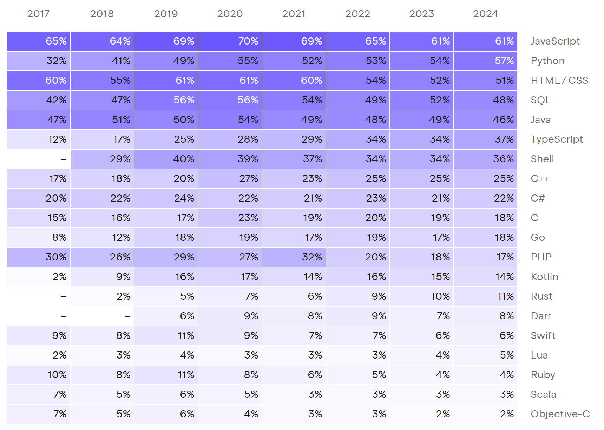
<div text-center text-sm op-60>
编程语言的使用情况 <span text-xs>(Jetbrains, 2024)</span>
</div>
</div>

<style>
.slidev-page li>p {
  --uno: my-0;
}
</style>

---

# 代码体积为何重要?

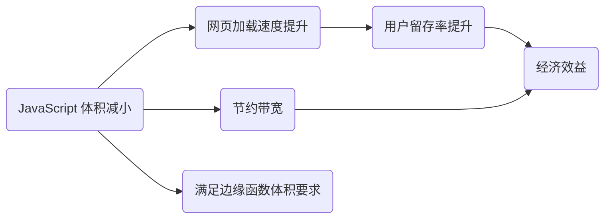

<div v-drag="[475,265,248,NaN]" px-4 bg-gray-200 rounded-lg>

JavaScript 是**唯一**普遍需要压缩自身体积的高级语言

</div>

---
dragPos:
  semantic: 380,128,385,80
  grammar: 380,222,421,80
  binary: 380,300,388,75
  title: 380,51,388,56
class: pl-20
---

<div v-drag="'title'">

# 体积优化的步骤

</div>

```js {*}{lines:false}
function greet(name) {
  pure();
  console.log("Hello, " + name);
}
greet("World");
```

```js {*}{lines:false}
function greet() {
  console.log("Hello, World");
}
greet();
```

```js {*}{lines:false,class:'children:children:children:(text-wrap break-all)'}
function a(){console.log("Hello, World")}a();
```

```txt {*}{lines:false}
010100110010101...
```

<div v-drag="'semantic'">

**[步骤一：语义层次]{.text-red}**&emsp;（复杂度高）<br>
进行程序分析，优化代码体积

</div>
<div v-drag="'grammar'">

**[步骤二：语法层次]{.text-blue}**&emsp;（已经完善）<br>
按照语法结构，删除无用字符


</div>
<div v-drag="'binary'">

**[步骤三：二进制层次]{.text-gray-600}**（语言无关） <br>
Gzip 压缩，减小传输体积

</div>


<div v-drag="[253,99,68,20]" border="rounded-md red 2" />


<div v-drag="[85,81,75,20]" border="rounded-md red 2" />


<div v-drag="[151,186,40,20]" border="rounded-md blue 2" />


<div v-drag="[81,204,20,20]" border="rounded-md blue 2" />

<div v-drag="[264,119,55,NaN]" text-xs text-red>函数特化</div>


<style>
.slidev-code-wrapper {
  width: 40%;
}
.shiki {
  --uno: mt-4;
}
</style>

<!--
- 简单到复杂

Minifier: 按照语法结构
"Minifier" 来源: link

1. 分析的复杂度：Syntax Level < Semantic Level
2. 实际做优化：JavaScript code size != 一般的程序分析

Background and Motivation
-->

---

# 现有工具 {.mt--4.!text-3xl.!mb-4}

| 名称 | 发起时间 | 空白字符<br>消除 | 常量<br>折叠 | 模块间<br>优化 | 死分支<br>删除 | 函数<br>内联 | 函数<br>特化 | 无用属性<br>删除 | 属性名<br>缩减 |
| - | - | - | - | - | - | - | - | - | - |
| [Closure Compiler](https://github.com/google/closure-compiler) | 2009 | <i yes /> | <i yes /> | <i no /> | <i yes /> | <i yes /> | <i no /> | <i no /> | 不可靠 |
| [Terser](https://terser.org/) | 2012 | <i yes /> | <i yes /> | <i no /> |  <i yes /> | <i no /> | <i no /> | <i no /> | <i no /> |
| [UglifyJS](https://github.com/mishoo/UglifyJS/) | 2012 | <i yes /> | <i yes /> | <i no /> |  <i yes /> | <i no /> |  <i no /> |  <i no /> |  不可靠 |
| [Rollup](https://rollupjs.org/) | 2015 | <i no /> | <i no /> | <i yes /> | <i yes /> | <i no /> | <i yes /> | 浅层 | <i no />  |
| [swc](https://swc.rs/) | 2017 |  <i yes /> | <i yes /> | <i no /> | <i yes /> |  <i yes /> |  <i no /> | <i no />  |<i no />  |
| [Prepack](http://prepack.io/) (已放弃) | 2017 | <i no /> | <i yes /> | <i no />  | <i yes /> | <i yes />  | <i yes /> |  <i yes /> | <i no /> | 
| [esbuild](https://esbuild.github.io/) | 2020 |  <i yes /> | <i yes /> | <i no /> | <i yes /> |  <i no />  | <i no /> | <i no />  |<i no />  |
| [oxc](https://oxc.rs/) | 2023 |  <i yes /> | <i yes /> | <i no /> | <i yes /> |  <i no />  | <i no /> | <i no />  |<i no />  |
| [Rolldown](https://rolldown.rs/) | 2023 | <i no /> | <i no /> | <i yes /> | <i no /> | <i no /> | <i no /> | <i no /> | <i no />  |

<div mt-2 ml-2 text-4>

- 各工具侧重点不同，通常组合使用（e.g. Rollup + Terser）
- 唯一具有深度优化功能的 Prepack 没有成功

</div>


<div v-drag="[602,39,140,NaN]" text-xs hidden>

<carbon-checkmark />: 支持<br>
<carbon-close-large />: 不支持<br>
<carbon-circle-outline />: 支持但不可靠<br>


</div>

<style scoped>
table {
  --uno: text-xs mt--2;
}
:deep(td) {
  padding: 4px 0.5rem !important;  
}
:deep(th) {
  padding: 4px 0.5rem !important;  
}

i[no] {
  --uno: i-carbon-close-large block w-4 h-4 text-red-600;
}

i[yes] {
  --uno: i-carbon-checkmark block w-4 h-4 text-green-800;
}

/* :deep(td:first-child) {
  --uno: font-bold;
} */
</style>

---

<div mt--3>

# 目标 {.!text-8} 

</div>

<div grid grid-cols-2 gap-6 children:h-34>
<div border="1.5 #555 rounded-lg" px-4 py-2>
  <div text-xl mb-2 font-serif> <carbon-navaid-military-civil /> 高精度 </div>
  <div class="!children:children:leading-6">

- inter-procedural
- context-sensitive 
- field-sensitive

</div>
</div>
<div border="1.5 #555 rounded-lg" px-4 py-2>
  <div text-xl mb-2 font-serif> <carbon-checkmark /> 可靠 </div>
  <div> 仅作少数合理假设，<br>保证优化前后程序等价 </div>
</div>
<div border="1.5 #555 rounded-lg" px-4 py-2>
  <div text-xl mb-2 font-serif> <carbon-rocket /> 非迭代 </div>
  <div> 优化是幂等的，只需执行一轮 </div>
</div>
<div border="1.5 #555 rounded-lg" px-4 py-2>
  <div text-xl mb-2 font-serif> <carbon-new-tab /> 可拓展 </div>
  <div> 解耦地定义函数行为，<br>可以扩充专门的优化 </div>
</div>
</div>

<!--
例子：揭示其中的一点
-->

---

<div mt--3>

# 为何困难? {.!text-8} 

</div>

```js {*}{lines:false}
function makeCounter(options) {
  let count = options?.init || options * 0;
  return () => {
    return count++;
  }
}

const counter1 = makeCounter({
  __proto__: {
    ["in" + "it"]: 1,
  }
});
const counter2 = makeCounter("2");
```

<div text-2 op-50 w-110>
[1]: Lucas, W., Nunes, R., Bonifácio, R. et al. Understanding the adoption of modern Javascript features: An empirical study on open-source systems. Empir Software Eng 30, 107 (2025). https://doi.org/10.1007/s10664-025-10663-9
</div>


<div v-drag="[78,134,159,64]" border="rounded-md red 2" />

<div v-drag="[320,114,99,20]" border="rounded-md red 2" />

<div v-drag="[77,261,91,20]" border="rounded-md red 2" />

<div v-drag="[96,282,114,20]" border="rounded-md red 2" />

<div v-drag="[297,344,46,20]" border="rounded-md red 2" />

<div v-drag="[241,174,609,NaN]" text-red>
函数是一等公民
<span text-black text-sm pl-1>(<span font-mono>67.08%</span> 的项目使用该特性<sup op-50>1</sup>)</span>
</div>

<div v-drag="[124,300,484,NaN]" text-red>
动态属性名
<span text-black text-sm pl-1>(<span font-mono>24.05%</span> 的项目使用该特性<sup op-50>1</sup>)</span>
</div>

<div v-drag="[183,255,152,NaN]" text-red>原型链的使用</div>

<div v-drag="[366,132,101,NaN]" text-red>弱类型</div>

<div v-drag="[348,338,101,NaN]" text-red>多态</div>

<div v-drag="[498,307,245,NaN]" bg-gray-200 px-4 py-2 rounded-lg>

- 做最坏的假设
- 同时要求优化效果

</div>

<style scoped>
:deep(.slidev-code) {
  --slidev-code-font-size: 14px;
  --slidev-code-line-height: 1.4;
}
</style>

---
hide: true
---

# 为何困难?

<!-- JavaScript 作为弱类型的解释型语言，具有高度的动态特性。它使用基于原型链的继承机制，并允许使用动态计算的属性名添加、删除和修改对象的属性和方法。这些特性使得 JavaScript 代码的静态分析变得非常困难。 -->

<div flex justify-between gap-8 pr-12>
<div>

- 弱类型
- 原型链＋动态属性名
- 函数是一等公民

</div><div>

- 真实存在的各种写法
- 大量代码无法精确分析

</div><div>

- 做最坏的假设
- 但又要保证效果

</div>
</div>

<div mt-4 grid grid-cols-2 gap-4>
<div>

```js {*}{lines:false}
const key = () => Math.random() > 0.5;
const obj = {
  __proto__: {
    [key()]: 1,
  },
  set [key()](x) {
    console.log(super[key()], x);
  }
}
obj[key()] = 10;
```

</div>
<div>

```js {*}{lines:false}
function cache(fn) {
  const cache = {};
  return x => cache[x] ??= fn(x);
}
const sigmoid = cache(
  x => 1 / (1 + Math.exp(-x))
);

// Impossible to track
setTimeout(sigmoid, 1000, 1);
```

</div>
</div>

<!--
英才班：具代表性的

 ComputedPropertyAssignment: 33.54
ArrowFunctionDeclarations:  87.97

实证分析的文章 -> 数据：特征的使用的情况
-->

---
hide: true
---

- 基于规则，多 pass
- 缺少对象属性的重命名
- 高级优化要求所有的函数和对象都已知
- 可拓展性不强


<!--
时间
benchmark
结论太笼统

描述
-->


---
hide: true
---

Previous Work{.sect}

## Prepack

由 Facebook 推出，于 2021 年废弃


<div mb-2 flex gap-4>

```js {*}{lines:false,class:'w-64'}
for (let a = 1; a < 10; a++) {
  console.log(a)
}
```

<div i-carbon-arrow-right w-20 text-4xl op-60 mt-4 />

```js {*}{lines:false,class:'w-64'}
console.log(1);
console.log(2);
// ... x10
```

</div>

1. 内部实现过于复杂
2. 要求整个运行环境已知，降低了实用性

<!--
运行环境 -> 所有函数有源码
-->

---
clicks: 2
---

# 三种思路 {.text-center.!text-8.mt--4}

<div fixed inset-0 flex items-center justify-center pt-6 pl-6>
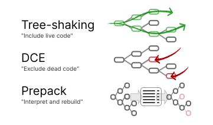
</div>

<div v-click transition duration-400 :class="$clicks < 1 ? 'op-0' : ''" bg-gray-200 bg-op-60 backdrop-blur-5 v-drag="[113,174,575,116]" flex items-center justify-center text-3xl>
已完善，但缺乏深入优化
</div>

<div v-click transition duration-400 :class="$clicks < 2 ? 'op-0' : ''" bg-gray-200 bg-op-60 backdrop-blur-5 v-drag="[113,290,575,116]" flex items-center justify-center text-3xl>
工作量过大，不现实
</div>

---
hide: true
---

# 改进

### 抽象

按照直观的 JS 语义分析代码

<carbon-arrow-right /> 提高了分析的“性价比”

<div h-4 />

### 直接变换

直接分析 AST 节点的使用情况，并变换代码

而不是收集副作用列表再序列化

<carbon-arrow-right /> 实现更简单；优化后代码体积可控

---
hide: true
---

# Tree-shaking

<div />

[*Tree-shaking versus dead code elimination* by Rich Harris, 2015](https://medium.com/@Rich_Harris/tree-shaking-versus-dead-code-elimination-d3765df85c80){.op-80.text-xs}

| Tree-shaking | 先假定所有代码无用，通过分析来褪优化其中有用的部分 <div op-80> "Include live code" </div> |
| - | - |
| DCE | 反复应用一组规则去删除无用代码 <div op-80> "Exclude dead code" </div> |
| Prepack etc. | 记录副作用再重新生成等效代码 <div op-80> "Interpret and rebuild" </div> |


---
transition: view-transition
---

# 整体架构 {.text-center.!text-8.my--2.mt--4}

<DesignOverview scale-115 origin-left-top ml-8 />

---

<div fixed inset--4 view-transition-analysis border-2 border-gray-400 rounded-lg />

# 如何描述值？


---
transition: view-transition
---

# 有哪些 "Value"？

<div grid grid-cols-5 gap-4>

<div border="2 #107ba5 rounded-lg" p-2 flex flex-col>
  <div text-center> Literal </div>
  <div font-mono text-xs>
  String("abc") <br>
  Number(42) <br>
  BigInt(42n) <br>
  Boolean(true) <br>
  Symbol(1) <br>
  Undefined <br>
  Null <br>
  </div>
  <div flex-grow />
  <div text-3 leading-2 op-70 italic font-serif>
    AST-representable
  </div>
</div>

<div border="2 #107ba5 rounded-lg" p-2 flex flex-col>
  <div text-center> Primitive </div>
  <div font-mono text-xs>
  AnyString <br>
  AnyNumber <br>
  AnyBigInt <br>
  AnyBoolean <br>
  AnySymbol <br>
  AnyPrimitive
  </div>
  <div flex-grow />
  <div text-3 leading-2 op-70 italic font-serif>
    non-"Object"
  </div>
</div>

<div flex flex-col gap-2>
<div border="2 #259117 rounded-lg" p-2 view-transition-object>
  <div text-center> Object </div>
</div>
<div border="2 #259117 rounded-lg" p-2>
  <div text-center> Array </div>
</div>
<div border="2 #259117 rounded-lg" p-2>
  <div text-center> Function </div>
</div>
<div border="2 #259117 rounded-lg" p-2>
  <div text-center> React VNode </div>
</div>
</div>

<div flex flex-col gap-2>
<div border="2 #e46f48 rounded-lg" p-2>
  <div text-center> ⊤ Unknown </div>
</div>
<div border="2 #e46f48 rounded-lg" p-2>
  <div text-center> ∪ Union </div>
</div>
<div border="2 #e46f48 rounded-lg" p-2>
  <div text-center> ⊥ Never </div>
</div>
<div flex-grow />
</div>


<div flex flex-col gap-2 op-50>
<div border="2 #999999 rounded-lg" p-2>
  <div text-center> Arguments </div>
</div>
<div relative border="2 #999999 rounded-lg" p-2>
  <div text-center absolute text-sm w-full mx--2 mt-.5> Logical Result </div>
  <div text-center invisible> ___ </div>
</div>
</div>

</div>

<div text-2xl pt-4 text-center>

复杂度与精确性的权衡

</div>

---

<div fixed inset-0 view-transition-object border="4 #259117 rounded-lg" />

<div relative flex gap-12 mt--5>
<div>
<div text-center>
<codicon-key />
Key Space
</div>
<div relative flex flex-col gap-2 border="2 rounded-xl #0072B2 op-60" p-2>
<div flex flex-col gap-2 border="2 dashed rounded-lg  #999999" p-2>
<div text-xs ml-.5 mt--2 mb--2 font-mono font-bold op-60 text-center>
Literal Keyed
</div>
<div v-for="i in 3" border="2 #D55E00 rounded-lg op-60" px-2 h-16 :data-arrow-from="i" font-mono flex items-center justify-center>
  "key{{i}}"
</div>
</div>
<div flex-grow border="2 #999999 rounded-lg " px-2 data-arrow-from="rest"> 
<div text-xs ml-.5 font-mono font-bold op-60 text-center>
Rest Properties
</div>
<div font-mono flex items-center justify-center mb-2 py-2 font-bold>
  ...
</div>
</div>
<div absolute bottom-0 left-0 right--.3 h-10 data-arrow-from="unknown" />
</div>
</div>

<div flex flex-col gap-2 w-62>
<div text-center mb--2>
<codicon-symbol-field />
Value Space
</div>

<PropertyValue data-arrow-to="1" />
<PropertyValue data-arrow-to="2" />
<PropertyValue data-arrow-to="3" />
<PropertyValue :kind="2" data-arrow-to="rest" />
<PropertyValue :kind="3" data-arrow-to="unknown" />

<ArrowConn arrow-id="1" color="#E69E66"/>
<ArrowConn arrow-id="2" color="#E69E66"/>
<ArrowConn arrow-id="3" color="#E69E66"/>
<ArrowConn arrow-id="rest" color="#999999"/>
<ArrowConn arrow-id="unknown" color="#66AAD1"/>

</div>


<div flex flex-col gap-2 ml--2>
<div text-center mb--2>
<codicon-symbol-class />
Prototype
</div>
<div relative text-xs leading-3 flex text-center items-center>
  <div border="2 #009E73 op-60" rounded-lg p-1 pb-2 flex flex-col items-center w-16>
    <carbon-null-sign block my-1 />
    Null or<br>Implicit
  </div>
  <div text-11 mt--2 op-50 origin-center scale-x-60 font-bold> / </div>
  <div border="2 #009E73 op-60" rounded-lg p-1 pb-2 flex flex-col items-center w-16>
    <carbon-object block my-1 />
    Custom<br>Object
  </div>
  <div text-11 mt--2 op-50 origin-center scale-x-60 font-bold> / </div>
  <div border="2 #009E73 op-60" rounded-lg p-1 pb-2 flex flex-col items-center w-16>
    <carbon-help block my-1 />
    Unknown<br>Value
  </div>
</div>

<div text-center mb--2 mt-4>
<codicon-list-unordered />
Metadata
</div>
<div flex flex-col gap-2 text-xs text-center>
<div border="2 rounded-lg #999999 op-80" px-2 py-1> Consumed Flag </div>
<div border="2 rounded-lg #999999 op-80" px-2 py-1> Mangling Group ID </div>
<div border="2 rounded-lg #999999 op-80" px-2 py-1> Control-flow Scope ID </div>
<div border="2 rounded-lg #999999 op-80" px-2 py-1> ... </div>

</div>
</div>

</div>

<div v-drag="[501,331,287,76]" text-10 class="text-#259117">
Object Value
</div>

---
class: Execution
---

# 分析阶段 - 一个例子


<div grid grid-cols-2 gap-4>

```js {1|2|3|4}
let [[x]] = 1;
if (unknown)
  x++;
console.log(x);
```

<div>

### 控制流依赖

<div v-click="[2,3]">

- `unknown` 为真值 [*covered later]{.op-60.text-xs.italic}

</div>

### 表达式的值 <div float-right> 依赖 </div>

<v-clicks at="0">

- `x`: Number(1) <Deps float-right>1</Deps>
- `a`: Unknown <Deps float-right></Deps>
- `x'`: Number(2) <Deps float-right>x</Deps>
- `x''`: Union\[`x`, `x'`\] <Deps float-right>a</Deps> <br>
  `console.log`: Unknown <Deps float-right></Deps>

</v-clicks>

</div>
</div>

---

<div>

# 无法精确追踪时 {.!text-4xl}

</div>

| **情况** | **例子** | **循环？** | **回调？** |
| ---- | ---- | ---- | ---- |
| 未知次数的循环 | `while (unknown) { ... }` | 是 | 否 |
| 未知深度的递归 | `function rec() { rec() }` | 是 | 是 |
| 生成器 / 异步函数 | `async gen*() { ... }` | 否 | 是 |
| 完全失去追踪 | `setTimeout(() => { ... }, 1)` | 是 | 是 |

---
hide: true
---

# Object::get_property

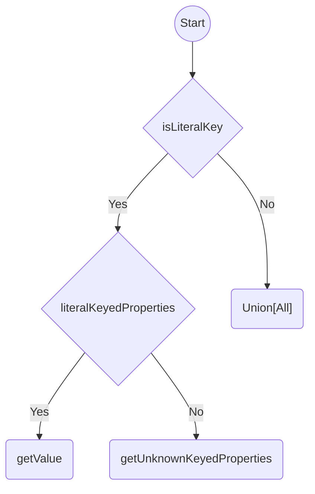

---
hide: true
---

# 优化手段

<div />

<div grid grid-cols-2 gap-8>
<div>

相互解耦的各项优化：

- Dead Code Elimination
- Constant Folding
- Property Name Mangling
- React.js Optimizations
- ... [(extendable)]{.text-sm.op-70.font-serif.italic}

</div>
<div pt-18>

- 定义新的 Dependency 种类
- 定义内置函数的（抽象）实现
- 自定义某些节点的分析和转换

</div>
</div>

---
transition: view-transition
---

# 整体架构 {.text-center.my--2}

<DesignOverview scale-115 origin-left-top ml-8 />

---
hide: true
dragPos:
  a: 54,94,146,56
  b: 327,305,126,42
  c: 241,361,128,42
  d: 425,97,128,60
  e: 415,180,128,42
  f: 389,244,128,42
  x: 561,272,263,136
---

## Optimizer{.sect} Dead Code Elimination

<div v-drag="'a'" data-arrow-from="b c d e f">

```js {*}{lines:false,class:'w-36 z-10'}
if (cond) A;
else B;
```

</div>
<div v-drag="'b'" data-arrow-to="b">

```js {*}{lines:false,class:'w-36'}
A;
```

</div>
<div v-drag="'c'" data-arrow-to="c">

```js {*}{lines:false,class:'w-36'}
B;
```

</div>
<div v-drag="'d'" data-arrow-to="d">

```js {*}{lines:false,class:'w-36'}
if (cond) A;
else B;
```

</div>
<div v-drag="'e'" data-arrow-to="e">

```js {*}{lines:false,class:'w-36'}
if (cond) A;
```

</div>
<div v-drag="'f'" data-arrow-to="f">

```js {*}{lines:false,class:'w-36'}
if (!cond) B;
```

</div>

<ArrowConn v-for="id in 'bcdef'" :arrow-id="id" color="#A5A5A5" />

<div v-drag="'x'" text-sm>

<div>
Other Conditional Nodes
</div>

- `a ? b : c`
- `a && b`, `a || b`, `a ?? b`
- `const [x = 1] = a`
- `([x = 1] = a)`
- `function (x = 1) {}`

</div>

---

# 死代码消除 {.view-transition-dce}

条件真假不确定，还能优化吗？

<div flex gap-8>
<div>

```js {*}{lines:false,class:'w-68'}
function f(cond, callback) {
  if (cond) {
    callback();
  } else {
    console.log("else");
  }
}

f(truthyValue, pureFunction);
f(falsyValue, anything);
```

</div>
<div>

<div i-carbon-arrow-right w-12 text-4xl op-60 mt-4 />

</div>
<div>

```js {*}{lines:false,class:'w-68'}
function f() {
	console.log("else");
}

f();
```

<div mt-10>
如果整个函数调用被删除，<br>
则其对应的执行情况无需被考虑。
</div>

</div>
</div>

<style scoped>
:deep(.slidev-code) {
  --slidev-code-font-size: 14px;
  --slidev-code-line-height: 1.4;
}
</style>

---
class: Execution
---

# 死代码消除 {.!text-3xl.mt--2}

```js {none}{class:'w-48', lines:false}
if (unknown)
  [[...]]
else
  [[...]]  
```


```js {none}{class:'w-48', lines:false}
if (truthy)
  [[...]]
else
  [[...]]  
```

<div v-drag="[300,80,321,26]" font-serif font-bold>
对每个分支分别添加执行依赖：
</div>


<div v-drag="[300,110,399,NaN]" text-sm leading-4 font-mono>
BranchDep (<br>
&emsp;分支 1 有副作用,<br>
&emsp;两个分支都有可能进入<br>)
</div>

<div v-drag="[300,188,436,NaN]" text-sm leading-4 font-mono>
BranchDep (<br>
&emsp;分支 2 有副作用,<br>
&emsp;两个分支都有可能进入<br>)
</div>


<div v-drag="[300,272,436,NaN]" text-sm leading-4 font-mono>
BranchDep (<br>
&emsp;分支 3 有副作用,<br>
&emsp;只有可能进入真分支<br>)
</div>

<div v-drag="[300,373,436,NaN]" text-sm leading-4 font-mono italic>
*不会被分析
</div>

---

# 死代码消除 {.!text-3xl.mt--2}

<div flex gap-16 mt-12>
<div>

<div text-sm font-bold text-red relative w-fit>
<div data-arrow-to="dce-post" absolute w-0 class="left-70%" />
Post Analysis:
</div>

```txt {*}{lines:false}
branchWorkList = all executed branches
nodeWorkList = all conditional nodes
changed = true
while changed:
  for B in branchWorkList:
    if B's closest parent function call is preserved:
      if the opposite of B is not pure:
        preserve B's possibility
        remove B from branchWorkList

  changed = false
  for N in nodeWorkList:
    if N may enter both consequent and alternative:
      consume N's all test values
      remove N from nodeWorkList
      changed = true
```

</div>
<div>

<div text-sm font-bold text-blue relative w-fit>
<div data-arrow-to="dce-transform" absolute w-0 class="top-30%" left--1 />
Transformation:
</div>

```txt {*}{lines:false}
for conditional node N:
  p1 = N's consequent is possible
  p2 = N's alternate is possible
  if p1 and p2:
    transform test with value preserved
  else:
    transform test side-effects only
  if p1:
    transform consequent
  else
    consequent is dead
  if has alternate branch:
    if p2:
      transform alternate
    else:
      alternate is dead
```

</div>
</div>

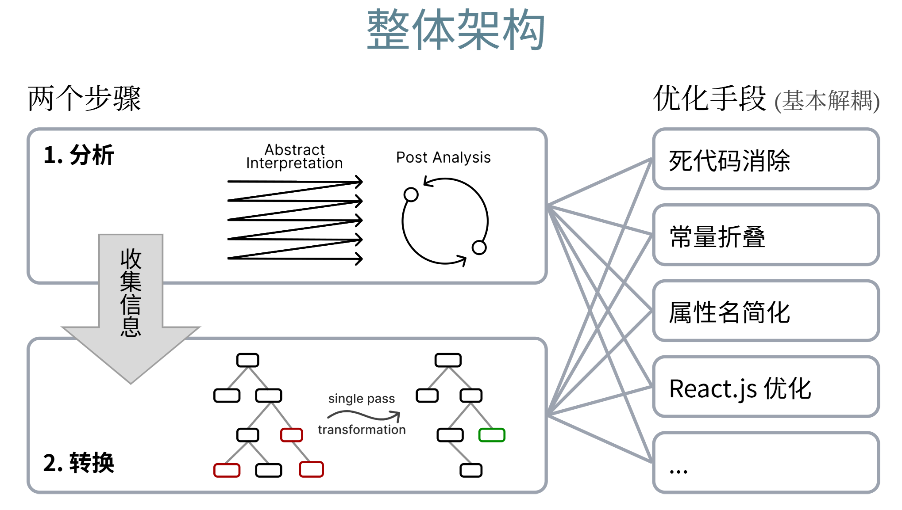

<div v-drag="[312,49,40,41]" border="2 red rounded-md">
<div data-arrow-from="dce-post" w-0 h-full />
<ArrowConn arrow-id="dce-post" color="rgb(248 113 113 / 60)"/>
</div>

<div v-drag="[226,102,131,40]" border="2 blue rounded-md">
<div data-arrow-from="dce-transform" absolute h-full right--2px />
<ArrowConn arrow-id="dce-transform" color="rgb(96 165 250 / 60)"/>
</div>

<style scoped>
:deep(.slidev-code) {
  --slidev-code-font-size: 10px;
  --slidev-code-line-height: 1.4;
}
</style>

---

# 常量折叠

若一个节点**优化后**只可能为**一种字面量值**，就可以将其折叠：

<div flex>

```js {*}{lines:false,class:'w-64'}
function f(value) {
  return { data: [[value]] };
}
const a = f(1), b = f(2);
x = a;
```

<div i-carbon-arrow-right w-20 text-4xl op-60 mt-6 />

```js {*}{lines:false,class:'w-64'}
function f() {
  return { data: [[1]] };
}
const a = f();
x = a;
```

</div>

只有在 `b` 作为无用代码被删除后，`f` 里的 `value` 才能折叠。

<style scoped>
:deep(.slidev-code) {
  --slidev-code-font-size: 16px;
  --slidev-code-line-height: 1.4;
}
</style>

---
hide: true
---

# 常量折叠 {.!text-3xl.mt--2}

<div flex mt-4>

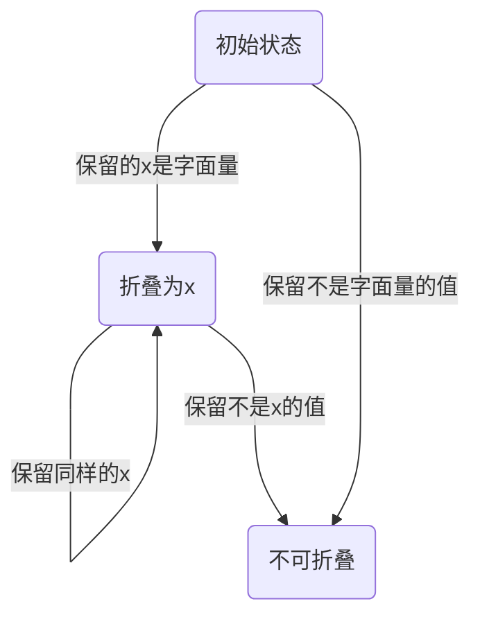

<div text-center flex flex-col items-center ml-8 mr-4>

使用依赖追踪

<carbon-arrow-right text-5xl op-60 mt-2 />

<div text-sm mt-4 w-fit>

- FoldableDep(x)
- NotFoldableDep

</div>

</div>

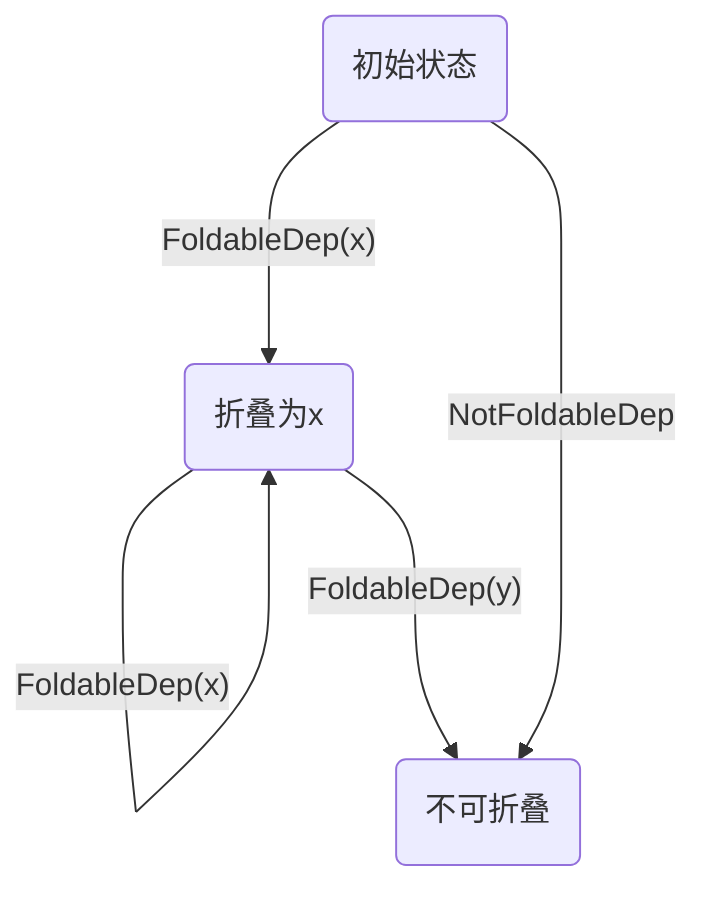

</div>

---
clicks: 1
---

# 常量折叠 {.!text-3xl.mt--2}

如何删除计算过程？

<div absolute left-14 top-30 transition-all duration-300 delay-300 :class="$clicks === 0 ? 'op-0' : ''">

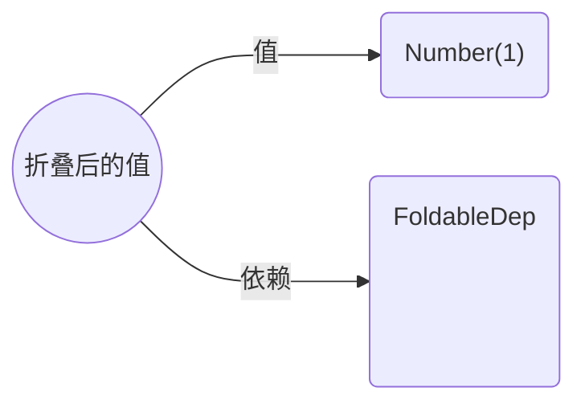

</div>

<div absolute transition-all duration-600 :class="$clicks === 0 ? 'left-14 top-30' : 'left-77 top-58'" >

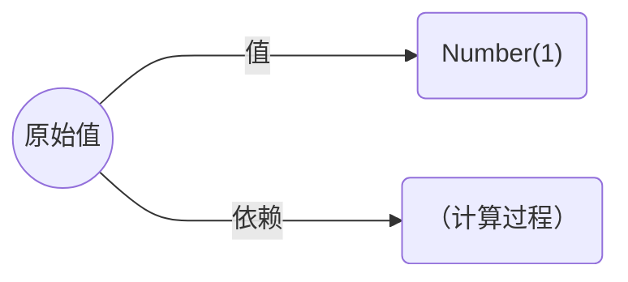

</div>

<div v-drag="[469,166,216,NaN]" px-2 py-1 border="2 dashed #999999 rounded-lg" transition-all duration-200 delay-600 :class="$clicks === 0 ? 'op-0' : ''">
阻止直接褪优化计算过程
</div>


---

# 对象属性名缩减

<div />

据估计，属性名约占现有工具输出代码体积的 [30%]{.font-mono.font-bold}：

```js {*}{lines:false}
const [[variableName]] = { [[propertyName{4}]]: 42 };
log([[variableName]].[[propertyName{4}]] * 2);
```

<carbon-arrow-down text-3xl my-2 op-60 ml-4 />

```js {*}{lines:false}
let [[e]]={[[propertyName{4}]]:42};log([[e]].[[propertyName{4}]]*2)
```

<style scoped>
.shiki {
  --slidev-code-font-size: 16px;
  --slidev-code-line-height: 1.6;
}
</style>

---
hide: true
---

### Optimizer{.sect} Property Name Mangling

[Terser](https://terser.org/) 和 [UglifyJS](https://github.com/mishoo/UglifyJS/) 支持此功能，但无法保证基本的正确性。比如：

```js {*}{lines:false}
const obj = { [[foo{1}]]: v1, [[bar{3}]]: v2 };
const key = t1 ? "[[foo{1}]]" : "[[bar{3}]]";
log(obj.[[foo{1}]], obj[key]);
```

会被错误地优化为：

```js {*}{lines:false}
const obj = { [[a{1}]]: v1, [[b{3}]]: v2 };
const key = t1 ? "[[foo{4}]]" : "[[bar{4}]]";
log(obj.[[a{1}]], obj[key]);
```

基于规则的局限性：效果好和正确性不可兼得 {.text-xl}

---
hide: true
---

### Optimizer{.sect} Property Name Mangling

### VSCode's Typing-based Approach {.my-4.font-serif}

- 编写脚本调用 TypeScript 提供的 **代码重构 ❯ 重命名** 功能
- 优点：用很少的代码实现了很好的效果
- 缺点：高度依赖类型注解<br>&emsp;&emsp;&emsp;无法处理第三方库的代码
- 无法用于一般的应用程序

据[官方博客](https://code.visualstudio.com/blogs/2023/07/20/mangling-vscode)，此项优化节约了 [14%]{.font-bold.font-mono} 的体积。

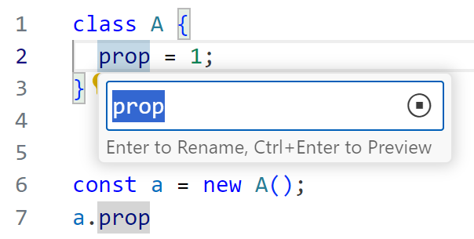

---
hide: true
---

### Optimizer{.sect} Property Name Mangling

优化的本质是**重命名字符串**，比如将：

```js {*}{lines:false}
const s1 = "[[hello{1}]]";
const s2 = unknown ? "[[hello{1}]]" : "[[world{3}]]";
console.log(s1 === s2);
```

优化为：

```js {*}{lines:false}
const s1 = "[[a{1}]]";
const s2 = unknown ? "[[a{1}]]" : "[[b{3}]]";
console.log(s1 === s2);
```

为什么可以优化？因为有意义的是相等性，而非字符串本身。

---
hide: true
class: Execution
zoom: 0.9
---

### Optimizer{.sect} Property Name Mangling

<div h-1 />

```js {1|2|3}
const a = "[[hello]]";
const b = unknown ? "[[hello]]" : "[[world]]";
const c = a === b;
```

<v-clicks at="0">

- `a`: String("hello") <Deps float-right><span><span text-dep>NOMANGLE</span>(<Dep>atom(1)</Dep>)</span></Deps>
- <code>b<sub>1</sub></code>: String("hello") <Deps float-right><span><span text-dep>NOMANGLE</span>(<Dep>atom(2)</Dep>)</span></Deps>
<br> <code>b<sub>2</sub></code>: String("world") <Deps float-right><span><span text-dep>NOMANGLE</span>(<Dep>atom(3)</Dep>)</span></Deps>
<br> `b`: Union\[<Dep><code>b<sub>1</sub></code></Dep>, <Dep><code>b<sub>2</sub></code></Dep>\] <Deps float-right></Deps>
- <code>c<sub>1</sub></code>: Boolean(true) <Deps float-right v-mark.box.red="{at:3}"><span><span text-dep>EQUAL</span>(<Dep>atom(1)</Dep>,<Dep>atom(2)</Dep>)</span></Deps>
<br> <code>c<sub>1</sub></code>: Boolean(false) <Deps float-right v-mark.box.red="{at:3}"><span><span text-dep>UNEQUAL</span>(<Dep>atom(1)</Dep>,<Dep>atom(3)</Dep>)</span></Deps>
<br> <code>c</code>: Union\[<Dep><code>c<sub>1</sub></code></Dep>, <Dep><code>c<sub>2</sub></code></Dep>\] <Deps float-right></Deps>

</v-clicks>

<div text-red v-drag="[459,335,143,NaN]" font-bold bg-red-100 px-4 py-2 leading-8 v-click="3">
Not <Deps><code>a</code>,<code>c<sub>1</sub></code></Deps> <br>
Not <Deps><code>a</code>,<code>c<sub>2</sub></code></Deps>
</div>

<style scoped>
:deep(.rough-annotation) {
  transform: scale(calc(1 / 0.9 / var(--slidev-slide-scale)));
}
</style>

---

# 对象属性名缩减 {.!text-3xl.mt--2}

引入了以下依赖 (**约束**)：

| | |
| ---- | ---- |
| <Dep><span text-dep>NOMANGLE</span>(<Dep>atom(1)</Dep>)</Dep> | <Dep>atom(1)</Dep> 不能变动 |
| <Dep><span text-dep>EQUAL</span>(<Dep>atom(1)</Dep>,<Dep>atom(2)</Dep>)</Dep> | <Dep>atom(1)</Dep> 和 <Dep>atom(2)</Dep> 应当保持相等 |
| <Dep><span text-dep>UNEQUAL</span>(<Dep>atom(1)</Dep>,<Dep>atom(2)</Dep>)</Dep> | <Dep>atom(1)</Dep> 和 <Dep>atom(2)</Dep> 应当保持不同 |
| <Dep><span text-dep>UNIQUE</span>(<Dep>group(1)</Dep>,<Dep>atom(1)</Dep>)</Dep> | <Dep>atom(1)</Dep> 应当在 <Dep>group(1)</Dep> 保持唯一 |

---
hide: true
---

### Optimizer{.sect} Property Name Mangling

How to resolve?

- Identity Groups
- Uniqueness Groups
- Atom States
  - Constrained[(Optional<IdentityGroupId>, Set<UniquenessGroupId>)]{.font-mono.text-xs}：被约束的字符串
  - Constant[(String)]{.font-mono.text-sm}：已解析为最终值的字符串
  - NonMangable：对应的 AST 节点不可重命名
  - Preserved：JS 内置的字符串，无对应 AST 节点

<!-- <div class="slidev-code !text-0.9rem">
EqualityGroups
UniquenessGroups
for each <span text-dep>dep</span> in 
</div> 

atomStates = { * -> any }
uniquenessGroups = []
identityGroups = []

for each C in all constraints:
  if C is NOMANGLE(A):
    atomStates[A] -> NOMANGLE
  else if C is EQUAL(A,B):
    if atomStates[A] is NOMANGLE:
      atomSta
  else if C is <span text-dep>NOMANGLE</span>:
    atomStates[C.atom] = C.atom
-->


---
hide: true
---

## Optimizer{.sect} Property Name Mangling

静态属性名本质上仍是字符串：

````md magic-move
```js {*}{lines:false}
const obj = {
  foo: 1,
};
obj.foo++;
```

```js {*}{lines:false}
const obj = {
  ["foo"]: 1,
};
obj["foo"]++;
```
````

- 一个对象内的各属性的名字须保持不同
- 访问原型链亦可视为字符串判等
- 所有动态访问情况都可以处理

<style scoped>
:deep(.slidev-code) {
  --slidev-code-font-size: 18px;
  --slidev-code-line-height: 2;
}
</style>

---

# 优化效果

<div flex items-end gap-1 text-sm v-drag="[212,57,300,21]">
测试集：<carbon-logo-github /> <a href="https://github.com/mischnic/tree-shaking-example">mischnic/tree-shaking-example</a>
</div>

<div h-2 />

| 名称 | 额外节约 | 优化耗时 | 输入体积\* | 输出体积\* |
| ---- | ---- | ---- | ---- | ---- |
| react-icons | 58.12% | 51ms | 9099B | 3811B |
| lodash-es | 44.98% | 34ms | 7108B | 3911B |
| rambdax | 44.95% | 11ms | 2089B | 1150B |
| material-ui | 44.03% | 3013ms | 180114B | 100807B |
| rxjs | 11.73% | 20ms | 2728B | 2408B |
| remeda | &nbsp;8.92% | 11ms | 986B | 898B |
| rambda | &nbsp;5.62% | 9ms | 587B | 554B |
| sentry | &nbsp;3.48% | 1557ms | 24477B | 23625B |
| lodash | &nbsp;1.11% | 7791ms | 25882B | 25595B |
| ramda | &nbsp;0.87% | 1743ms | 1952B | 1935B |

<div mt-4 italic op-80 text-sm>

\* 输入文件为 [Rollup]{.font-mono} 开启优化时的产物<br>
\* 输出均为 [oxc-minifier]{.font-mono} 和 Gzipped 处理后的结果

</div>

<style scoped>
table {
  --uno: text-sm mt--2;
}
:deep(td), :deep(th) {
  padding: 0 0.5rem !important;  
}
:deep(td:not(:first-child)) {
  --uno: font-mono;
}
:deep(td:first-child) {
  --uno: font-bold;
}
:deep(td:nth-child(2)) {
  --uno: font-bold;
}
</style>

---

# 优化效果

<div flex items-end gap-1 text-sm v-drag="[212,57,300,21]">
一些现实案例
</div>

| 名称  | 特点 | 额外节约 |
| - | - | - |
| NoVNC | No external library used | 20% |
| Guitar Studio | React + geist-ui | 20% |
| Calendar | React + Ant-design | 15% |
| Volar VSCode Extension | Super complex | &nbsp;8% |
| ZVMS | Vue + Element-plus  | &nbsp;3% |


# 推荐优化管线 {.!text-2xl.mt-8.text-center}

<div flex items-center justify-center>

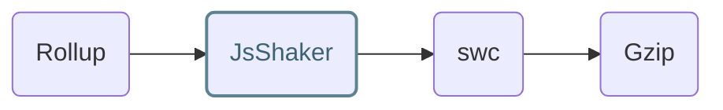

</div>

<style scoped>
table {
  --uno: text-sm mt--2;
}
:deep(td), :deep(th) {
  padding: 0 0.5rem !important;  
}
:deep(td:not(:first-child)) {
  --uno: font-mono;
}
:deep(td:first-child) {
  --uno: font-bold;
}
:deep(td:nth-child(3)) {
  --uno: font-bold;
}
</style>

---
layout: end
---

<div text-40 v-drag="[-2,224,40,40,-12]" op-50>
<carbon-star-filled text-yellow absolute />
<carbon-star-filled text-white op-20 absolute />
</div>

<div text-3xl>

感谢聆听！

</div>

<div text-white mt-24 mb--10 text-left z-101>
项目仓库: <span font-mono tracking-0>github.com/kermanx/tree-shaker</span><br>
&emsp;幻灯片: <span font-mono tracking-0>kermanx.com/jsshaker-ustc</span>
</div>
