# JsShaker {.font-serif}

<div op-80 class="text-2xl font-serif" pb-10>
Dependency-Tracked Abstract Interpretation for
<div h-1/>
JavaScript Code Size Optimization
</div>

<div pt-4 pb-6>
熊桐睿 许逸凡<br>
指导老师：张昱 丁伯尧
</div>

---

# 项目时间线

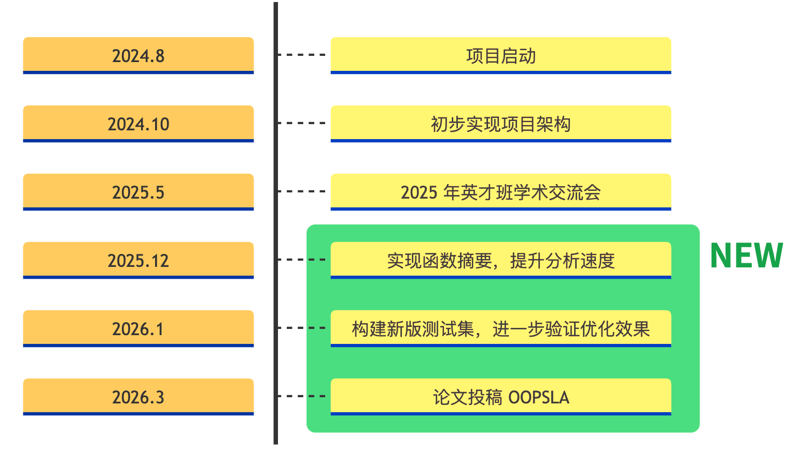{.w-190.ml-8.mt--4}

<!-- 
<div absolute left-364px top-301px w-358px h-190px bg-green-400 px-4 py-2 rounded-lg z--100>
<div absolute left-full pl-2 text-3xl font-bold text-green-600>
NEW
</div>
</div>

`1``mermaid {class:'mt--12 ml-0'}

config:
  theme: 'base'
  timeline:
    disableMulticolor: true

timeline TD
  2024.8 : 项目启动
  2024.10 : 初步实现项目架构
  2025.5 : 2025 年英才班学术交流会 
  2025.12 : 实现函数摘要，提升分析速度
  2026.1 : 构建新版测试集，进一步验证优化效果
  2026.3 : 论文投稿 OOPSLA
`1`` -->

<!--
<div v-drag="[56,495,0,0]">

</div>
-->

---

# 背景

- Octoverse 2025: TypeScript 和 JavaScript 成为 **top2 最广为使用的语言**

<!-- 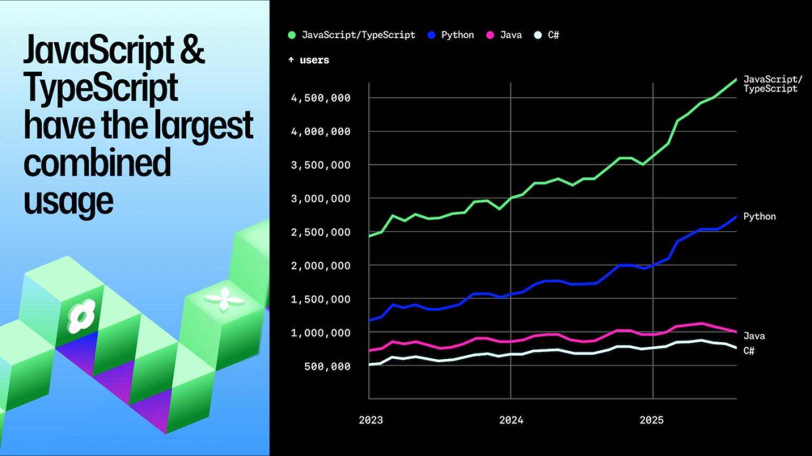 -->

- 平均每个应用依赖的 npm 包数量高达 **350** 个，带来了大量未使用的代码

- 代码膨胀的后果：**加载变慢，用户体验下降** / **开销增大，Serverless 和 IoT 场景受限**

- Example：无用代码的静态优化空间巨大：

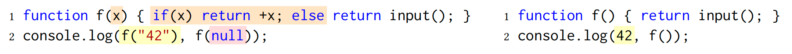

<div v-drag="[581,291,18,26]" font-bold>
→
</div>

<!--
Web 性能受损 — 大体积 bundle 延长网络下载时间，增加 CPU 解析和编译开销

用户体验下降 — 初始内容显示延迟，直接影响转化率和收入

新兴场景受限 — Serverless 边缘部署、IoT 嵌入式设备对代码体积有严格限制

生态根源 — 开发者习惯提取常量、使用描述性标识符、保留开发逻辑，进一步加剧膨胀
-->

---

# 现有主流解决方案

组合 Bundler 和 Minifier 工具，优化代码体积：

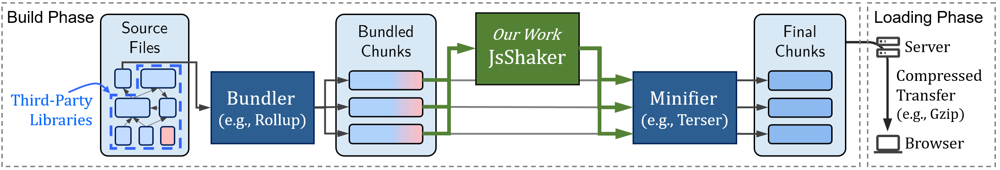

<div grid grid-cols-2 gap-8 mt-8><div>

# <span class="text-#2C5E91!"> Bundler </span>

- 合并多文件，剪除未用模块
- 关键技术：可达性分析
- 代表工具：Rollup

</div><div>

# <span class="text-#2C5E91!"> Minifier </span>

- 对语法做紧凑化重写
- 关键技术：多轮 AST 迭代变换
- 代表工具：Terser, Closure Compiler

</div></div>

---

# 现有技术路线

| **技术路线** | **代表工具** | **核心局限** |
| -- | -- | -- |
| 可达性分析 | Rollup, Webpack, Rolldown, Lacuna | 仅识别模块/函数级死代码 |
| 多轮 AST 重写 | Terser, esbuild, swc, Closure Compiler | 依赖预定义模式，缺乏语义洞察 |
| 抽象解释 | Prepack (已停止维护) | 符号执行 + 堆序列化过于复杂，难以支持完整语义 |
| 运行时裁剪 | Stubbifier, DepPrune, JSAnalyzer | 依赖测试覆盖或脚本级模式，不安全且速度极慢 |

---

# 本质问题

<div fixed top-0 bottom-0 left-10>

<div absolute left-0 top-26 w-86 h-86 bg-yellow-400 rounded-full bg-op-16 text-3xl flex items-center>
<div ml-4 text-yellow-900>语言动态性</div>
</div>

<div absolute left-40 top-4 w-86 h-86 bg-green-400 rounded-full bg-op-16 text-3xl flex justify-center>
<div mt-22 ml-20 text-green-900>编译速度</div>
</div>

<div absolute left-40 bottom-4 w-86 h-86 bg-purple-400 rounded-full bg-op-16 text-3xl flex justify-center items-end>
<div mb-22 ml-20 text-purple-900>优化效果</div>
</div>

<div absolute left-66 top-62 text-5xl>
?
</div>

<div absolute left-44 top-40 text-2xl text-gray-900>
Minifiers
</div>

<div absolute left-44 top-90 text-2xl text-gray-900>
Prepack
</div>

<div absolute left-87 top-62 text-2xl leading-1em text-gray-900>
Other<br>Languages
</div>

</div>

<div absolute top-10 left-148>

# 思路

<div mt-6>

<span bg-yellow-400 bg-op-16 text-2xl px-2 py-1 text-yellow-900>语言动态性</span>
<span text-3xl font-bold mt-1 op-70> & </span>
<span bg-purple-400 bg-op-16 text-2xl px-2 py-1 text-purple-900>优化效果</span>

<div flex items-center gap-1>
<div i-carbon-arrow-right text-4xl op-80 />
<span flex-grow class="bg-#2C5E91 text-white text-center text-2xl py-1">
抽象解释
</span>
</div>

</div>

<div mt-8>

<span bg-green-400 bg-op-16 text-2xl px-2 py-1 text-green-900>编译速度</span>
<span text-3xl font-bold mt-1 op-70> & </span>
<span bg-gray-400 bg-op-16 text-2xl px-2 py-1 text-gray-900>抽象解释开销大</span>

<div flex items-center gap-1>
<div i-carbon-arrow-right text-4xl op-80 />
<span flex-grow class="bg-#2C5E91 text-white text-center text-2xl py-1">
单轮分析优化
</span>
</div>

</div>

<div mt-8>

<span bg-gray-400 bg-op-16 text-2xl px-2 py-1 text-gray-900 line-through text-op-70
style="text-decoration-color: #00000080; text-decoration-thickness: 4px;">DCE：删除死代码</span>

<span bg-gray-400 bg-op-16 text-2xl px-2 py-1 text-gray-900>Tree-shaking：保留活代码</span>

<div flex items-center gap-1>
<div i-carbon-arrow-right text-4xl op-80 />
<span flex-grow class="bg-#2C5E91 text-white text-center text-2xl py-2">
带有依赖追踪的抽象解释
</span>
</div>

</div>

</div>

---

# 挑战

```js {*}{class:'children:text-16px!'}
const obj = {};
document.onclick = function() { console.log(obj.foo); }; // 逃逸的回调函数
obj[ThirdPartyLib.check() ? 'foo' : 'bar'] = 2; // ThirdPartyLib 对分析是不可见的
Object.setPrototypeOf(obj, { foo: 3 }); // 动态原型修改: obj.foo 现在是 2 或 3
```

1. 动态控制流 (Line 2)：无法构建静态[控制流图]{.text-blue-800}

2. 动态对象字段 (Line 3, 4)：难以实现[字段敏感分析]{.text-blue-800}

3. 输入为部分程序 (Line 3)：必须对未知代码做[保守假设]{.text-blue-800}

4. 源到源转换的约束：不适合使用[中间表示]{.text-blue-800}

5. 严格的构建时间要求：不适合多次执行昂贵的抽象解释（[单轮分析优化]{.text-blue-800}）

---

# 核心设计: [Dependency-Tracked]{.text-blue-600.text-3xl.underline} &nbsp;&nbsp;[Abstract Value]{.text-red-600.text-3xl.underline}

<div grid grid-cols-2 gap-12 mt-6>
<div px-2 py-0 flex-grow relative>
<!-- <div text-red-600>Abstract Value:</div> -->


[抽象值]{.text-red-600.font-bold}：对程序运行时真实数据的一种近似表示

程序运行时的具体值有无穷种可能，不可能枚举。

于是用“抽象值”来概括一类可能的具体值——它可以是“某个数字”“某个字符串”，甚至精确到“数字 42”。整个取值集合叫做“[抽象域]{.text-red-600.font-bold}”：

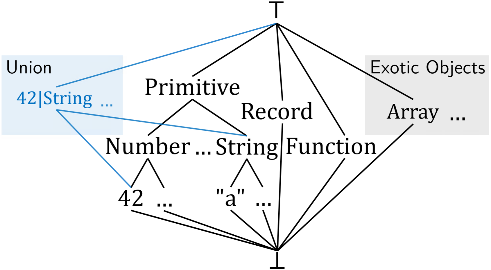


</div><div px-2 py-0 flex-grow>

[依赖追踪]{.text-blue-600.font-bold}：本工作的核心机制

不仅计算一个变量“是什么”（抽象值），还维护一个集合，记录哪些代码节点（比如某行赋值、某个函数调用）参与生成了这个值。

当这个值最终产生副作用（比如打印输出）或从可分析代码逃逸时，系统就把集合里的代码节点标记为 [Live（不可删除）]{.text-red-600.font-bold}。

基于此，优化器能在**单次分析**中精确判断哪些代码不可或缺、哪些可以安全删除，避免了传统方法需要多轮“分析—转换”的高昂开销。

</div>
</div>


---

# 整体架构

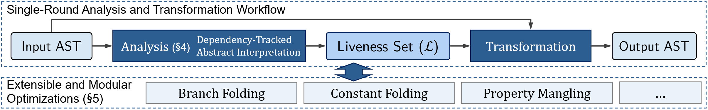

<div grid grid-cols-2 gap-8 mt-8><div>

# <span class="text-#2C5E91!"> 核心步骤 </span><span text-lg text-black>（实现了基础的死代码优化）</span>

- 静态分析（抽象解释）<br>
  with [Dependency-Tracked]{.text-blue-600} [Abstract Value]{.text-red-600}

- 代码转换

</div><div>

# <span class="text-#2C5E91!"> 高级优化 </span>

- 分支折叠
- 常量折叠
- 属性名简化
- ...（可拓展）

</div></div>

---

<div mt--4 />

[控制流分析]{.text-3xl.text-primary} -- 控制状态、控制帧、控制栈 / 确定性与依赖传播/ 非顺序控制流
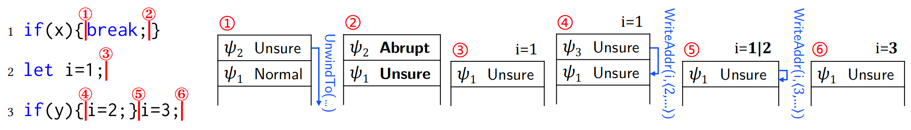

[数据流分析]{.text-3xl.text-primary} -- 求值规则 / 对象语义 / 逃逸值
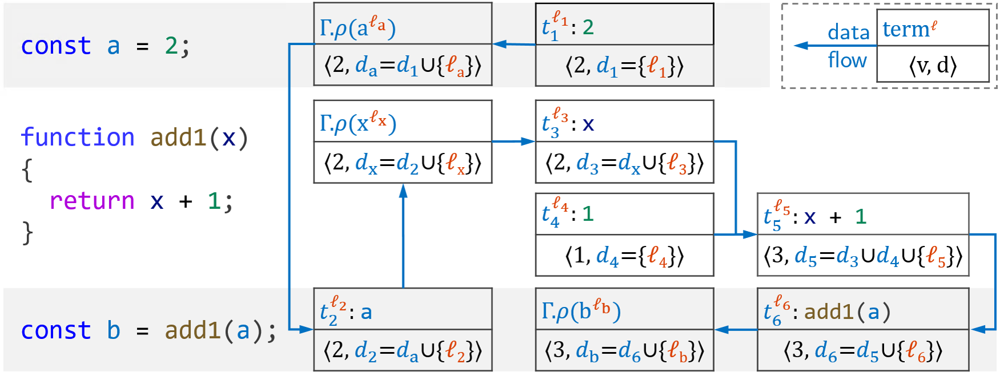{.h-64.mt-2}

---

<div mt--4 />

[数据流分析规则]{.text-3xl.text-primary}

<div text-2xl text-black pl-4>

$[op_1;\ op_2;\ \ldots] \triangleright \llbracket t^\ell \rrbracket \Downarrow \langle v,\,d \rangle$

<div mt--2 />

在全局状态下，抽象解释在位置 $\ell$ 的表达式 $t$ 的规则为<br>
1\. 执行操作 $op_1;\ op_2;\ \ldots$ &emsp; 2. 并得到抽象值 $v$ 和依赖集合 $d$

</div>

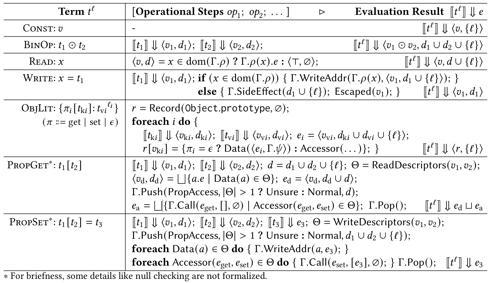

---

<div mt--4 />

[过程间分析]{.text-3xl.text-primary}

- 必要性：JavaScript 函数是**一等公民**；**函数特化**是重要的优化机会。

- 设计：**上下文敏感**的过程间分析；递归/逃逸的穷举分析机制。

[函数摘要]{.text-3xl.text-primary}

- 必要性：如果每次遇到函数调用都把函数体重新展开分析一遍，那么会让分析时间呈**指数级增长**。

- 设计：函数摘要本质上是一份“**复用缓存**”：它把函数针对不同输入的行为（返回值、修改了哪些外部变量、有没有副作用）提炼成模板。下次再遇到兼容的调用时直接套用这份缓存，而不必重新遍历函数体。

- 难点：和依赖分析兼容；平衡摘要的精确度和复用率。

- 效果：将优化速度提升了平均 1.58，最高 23.28 倍。

---

## 高级优化：分支折叠 {.text-primary.mb-4}

```ts {*}{lines:false,class:'children:text-base!'}
function assertPositive(x) {
  if (x > 0) { // [!code --]
    console.log('positive', x);
  } else { // [!code --]
    throw new Error('non-positive'); // [!code --]
  } // [!code --]
}
assertPositive(1);
```

<div class="small-table">

| [Formal Rules]{.text-primary.text-lg} | |
| - | - |
| Evaluation | 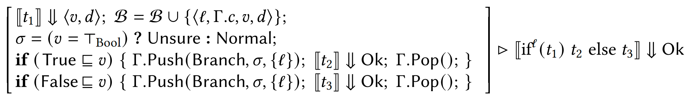 |
| Inclusion | 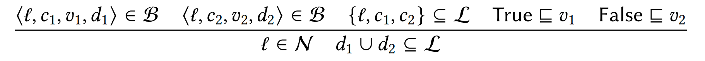 |
| Transformation | 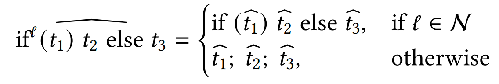 |

</div>

---

## 高级优化：常量折叠 {.text-primary.mb-4}

```ts {*}{lines:false,class:'children:text-base!'}
function compute(x, y) {
  if (x === 0) return -1; // [!code --]
  return Math.random() * x + y; // [!code --]
  return Math.random() * 1 + 2; // [!code ++]
}
console.log(compute(0), compute(1, 2)); // [!code --]
console.log(-1, compute()); // [!code ++]
```

<div class="small-table">

| [Formal Rules]{.text-primary.text-lg} | |
| - | - |
| Evaluation | 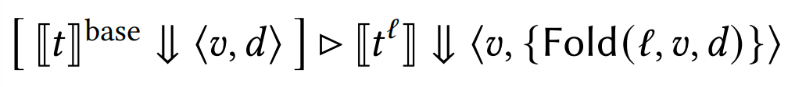 |
| Resolution | 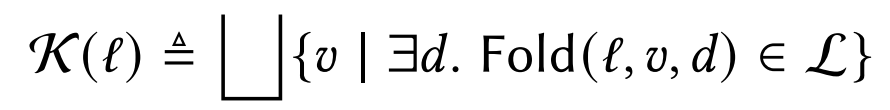 |
| Inclusion | 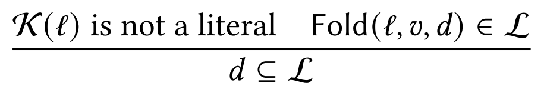 |
| Transformation | 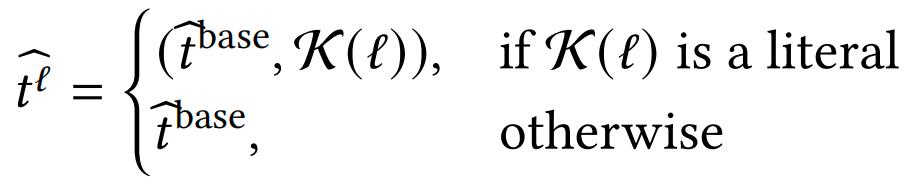 |

</div>

---

## 高级优化：属性名简化 {.text-primary.mb--2}

据估计，属性名约占打包后代码体积的 [30%]{.font-mono.font-bold}，具有巨大的优化空间，而现有的优化工具不能实现安全优化。

```ts {*}{lines:false,class:'children:text-base!'}
function getInfo(id) {
  return { age: ..., name: ... }; // [!code --]
  return { a: ..., b: ... }; // [!code ++]
}
const user = getInfo(42);
console.log(user.age, user.name); // [!code --]
console.log(user.a, user.b); // [!code ++]
```

<div class="small-table">

| [Formal Rules]{.text-primary.text-lg} | |
| - | - |
| Mangling Candidate | 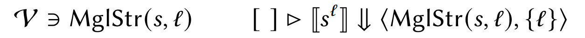 |
| Mangling Constraint | 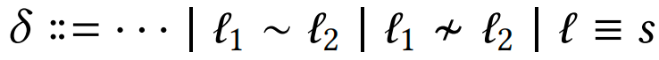 |
| Comparison Evaluation | 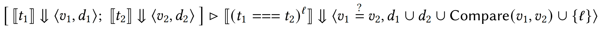 |
| Resolution | <span text-14px> Resolve $\mathcal{M}$ via a simple greedy solver </span> |
| Transformation | 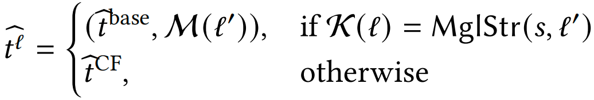 |

</div>

---

# Evaluation: Dataset

13 个由真实 JavaScript 项目构建的测试用例：

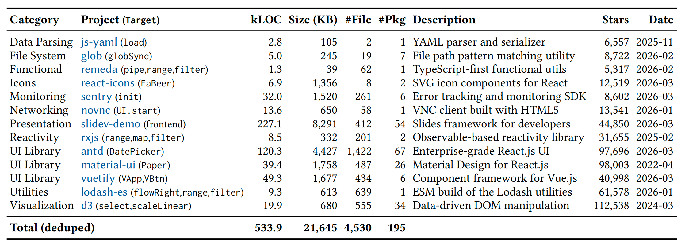

---

# Evaluation: Effectiveness

在所有测试用例上取得最优，*额外*删除 <strong>平均 27.6%，最高 66.7%</strong> 的代码体积：

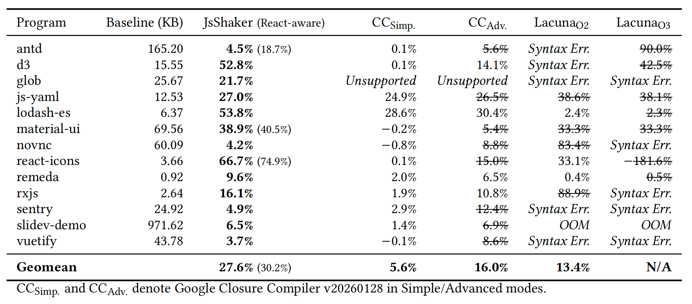{.w-208.ml--2}

---

# Evaluation: Ablation Study

左：分支折叠、常量折叠和属性名简化这三个高级优化分别贡献了平均 **12.0%**, **12.7%** 和 **3%** 的体积缩减。<br>
右：JsShaker 安全的属性名简化可以识别并优化平均约 **13.95%** 的可优化属性名。

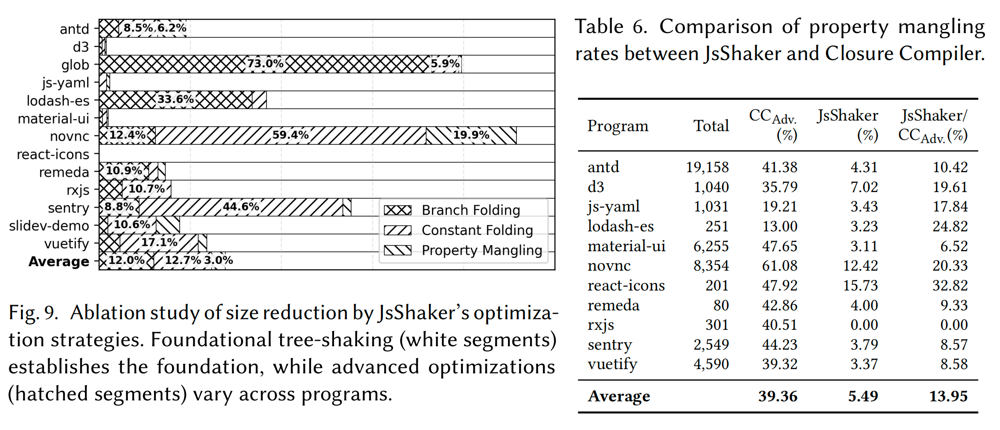{.mt--2}

---

# Evaluation: Performance

左：JsShaker 平均引入了 **14%** 的额外构建时间；右：MaxRecDepth=2 时较好地平衡了分析速度和优化效果。

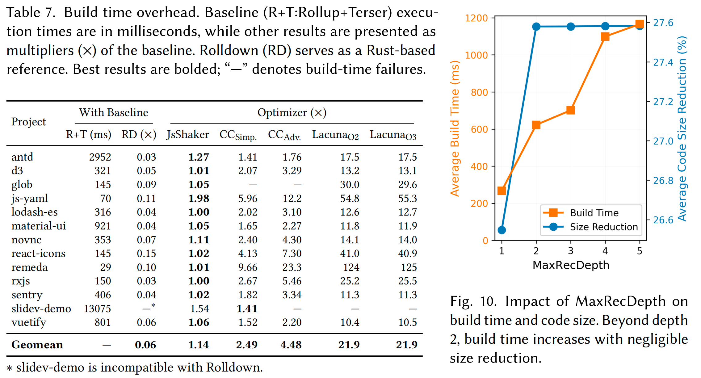{.w-180.mt--2}

---

# Evaluation: Function Summary Effectiveness

函数摘要技术的引入，将优化速度提升了<strong>平均 1.58，最高 23.28 倍</strong>：

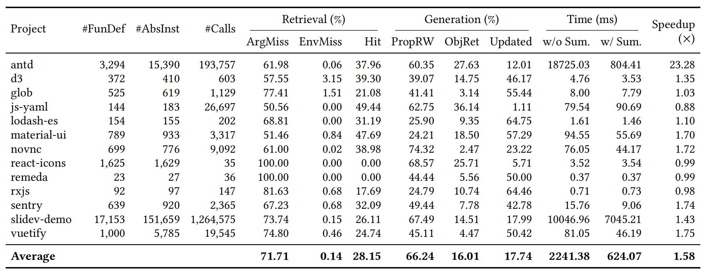

---

<div h-2 />

# 鲲鹏算力底座

- 将 JsShaker 部署于鲲鹏服务器集群，为大规模工程提供高性能构建服务
- 显著缩短 JavaScript 代码优化与打包时间，提升开发效率
- 支持弹性扩展，满足不同规模项目的构建需求
- 针对鲲鹏算力平台做针对性的调优

<div h-12 />

# 昇腾智能增强

- 引入昇腾 AI 加速器，探索 AI 辅助代码优化的可能性
- 通过机器学习模型预测代码的可优化模式，进一步提升优化效果和速度
  
---
layout: end
---

<!-- <div text-40 v-drag="[-23,249,40,40,-12]" op-50>
<carbon-star-filled text-yellow absolute />
<carbon-star-filled text-white op-20 absolute />
</div> -->

<div text-3xl mt-8>

谢谢大家！

</div>

<div text-white mt-24 mb--10 text-left z-101>
项目仓库: <span font-mono tracking-0>github.com/kermanx/tree-shaker</span><br>
&emsp;幻灯片: <span font-mono tracking-0>kermanx.com/jsshaker-ustc</span>
</div>
